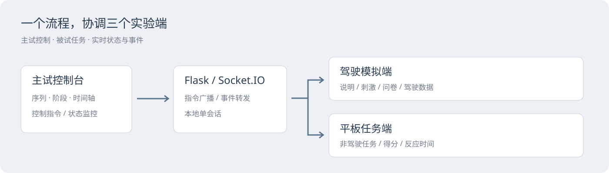
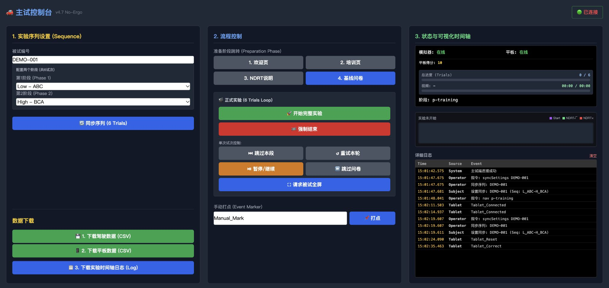
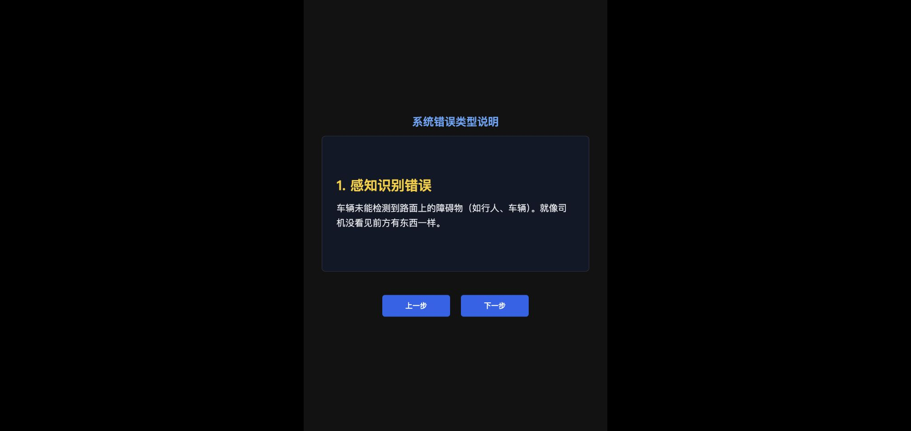
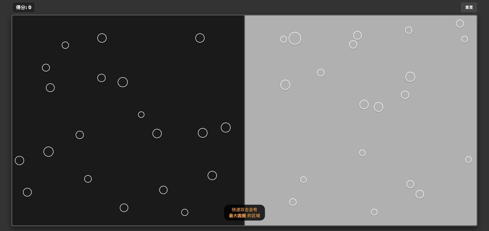

[在线项目介绍](https://capybarra1.github.io/cockpit-experiment-console/) · [GitHub 主页](https://github.com/capybarra1)

# 智能座舱实验控制台

> 研究工具｜主试、驾驶模拟、平板任务三端｜本地运行

## 问题：实验流程依赖多个设备的协同

主试需要配置试次、下发指令、切换阶段、观察被试端状态并导出数据。驾驶模拟端和非驾驶任务平板各自承担不同任务，分散操作容易让进度难以对应。

## 我的工作

梳理实验序列、角色与设备之间的关系，设计主试控制台、被试驾驶模拟端和平板任务端；完成 Flask + Socket.IO 实现、页面交互与实验环境部署。工具用于座舱研究实践。

## 三端分工

- **主试端：**被试编号、两阶段六试次配置、准备阶段跳转、开始/暂停/跳过、手动打点、进度与时间轴、导出入口。
- **驾驶模拟端：**说明与培训、基线问卷、刺激播放、试次评价及数据导出。
- **平板任务端：**非驾驶任务、正确/错误反馈、得分及反应时间事件。

## 一个演示任务

使用虚构编号 DEMO-001，在主试端同步 Low/High 阶段序列。主试发出培训页指令，驾驶模拟端切换；平板完成一次选择后，事件回传主试时间轴，并可下载平板 CSV。

公开包不含原研究视频和真实被试数据。研究刺激部分需要用户自行提供有使用权的素材；作品截图展示的是三端界面与合成操作，未声称完成全套研究实验。

## 设计取舍

主试端优先信息密度和全局可控性；被试端优先当前阶段的任务理解；平板端减少操作并记录反应事件。将同步、任务和记录串起来，比单独美化三个页面更重要。

## 当前限制

这是单会话本地研究工具：数据保存在浏览器或服务内存，不能当作多实验并行平台；断线重连、状态恢复、权限和持久化需要继续完善。公开版本默认本机访问并关闭调试，不用于开放网络。问卷和刺激需按实际研究设计核对。

## 面试可讲的能力

多角色信息架构、研究流程落地、实时交互原型，以及把实验人员的操作需求转成可用工具的能力。

[代码与启动](docs/quickstart.md) · [GitHub 主页](https://github.com/capybarra1)
